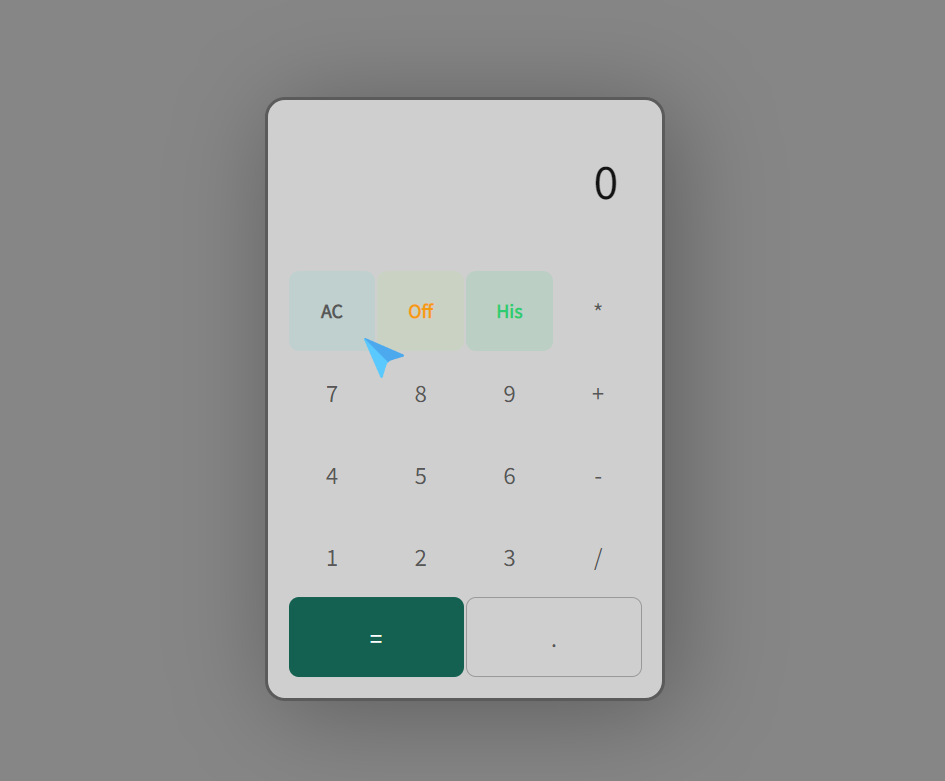

# Calculator
I created a calculator built with javascript. There are easier ways to create a calculator. But I tried to develop a calculator with ENCAPSULATION and abstraction.

### Live Link: https://mahinulabid1.github.io/Calculator/

## Language Used:
* HTML
* CSS 
* JavaScript
* Animatto_Cursor(JavaScript Librararies)
* Bootstrap (Very little amount)

### Unique Feature: 
User can access HISTORY. It means user can see what calculation did they perform.

### Code Characteristics: 
* Abstraction
* Encapsulation

Now, JavaScript isn't really a full object oriented programming language. But those OOP concepts can be practiced in JavaScript and that's what I tried to do by developing this calculstor.

#### Designed and developed by @Mahinul Mostafa Abid
